## Teste api REST - Amilton Siqueira - Baldussi

### Documentação:

#### Introdução:

Essa api foi desenvolvida com o intuito de fornecer ao usuário acesso a dados de usuários via requests http GET e POST, seguindo as especificações: 

Instruções:

Construir sua aplicação em Python.  
Realizar a consulta na API Random User Generator https://randomuser.me/  
Obter 100 requests.  
Modelar um DB Relacional (dê sua preferência) para armazenar os dados da consulta.  
Desenvolver 3 endpoints usando o framework dê sua preferência, sendo eles:

1. Get by gender
2. Get by age: retornar apenas usuários com 35 anos.   
3. Post gender and age: retornar usuário masculino e com 30 anos.
4. Publicar no Github

* Existem screenshots da api com um front simples no final do arquivo.

#### Endpoints

*   GET usuarios/genero/genero/

Neste endpoint deve ser substituido genero por male, female, homem, mulher. O resultado retornará todos os usuários deste gênero.

exemplo: www.dominio.com.br/usuarios/genero/mulher

*   GET usuarios/idade/idade/

Neste endpoint deve ser substituido idade pelo numero da idade o resultado retornará todos os usuários desta idade.

exemplo: www.dominio.com.br/usuarios/idade/28

*   POST /usuarios/

Este endpoint, quando acessado via POST contendo no body 'idade': 'idade' e 'genero': 'genero' retornará todos os usuários desta que possuam esta idade e genêro.

genero pode ser substituido por homem, mulher, male, female.

Neste projeto existe um arquivo .html com um formulário para especificamente fazer um post request com valores 'idade':'30', 'genero':'male'.

Isso porque o framework Django exige a existência de um token CSRF válido nos headers do request http POST, se não houver retornará status 403 Forbidden.

exemplo request body:

{ 'idade': '21', 'genero': 'mulher' }

## Nota sobre os dados

*   Não foram armazenados dados sensíveis como senhas em formato plain text, salts ou hashes.

#### Formato retornado pela api:

    {  
        "user\_profile": {  
            "gender": "male",  
            "title": "Mr",  
            "first\_name": "Krish",  
            "last\_name": "Chiplunkar",  
            "email": "krish.chiplunkar@example.com"  
        },  
        "location": {  
            "street\_number": 9186,  
            "street\_name": "Racecource Rd",  
            "city": "Ongole",  
            "state": "Uttar Pradesh",  
            "country": "India",  
            "postcode": "87611",  
            "latitude": "-47.941800",  
            "longitude": "96.064200"  
        },  
        "phone": "7650787171",  
        "cell": "8594056220",  
        "age": "28",  
        "id\_number": "478579824528",  
        "picture\_large": "https://randomuser.me/api/portraits/men/37.jpg",  
        "picture\_medium": "https://randomuser.me/api/portraits/med/men/37.jpg",  
        "picture\_thumbnail": "https://randomuser.me/api/portraits/thumb/men/37.jpg",  
        "nat": "IN"  
    }

### documentação
    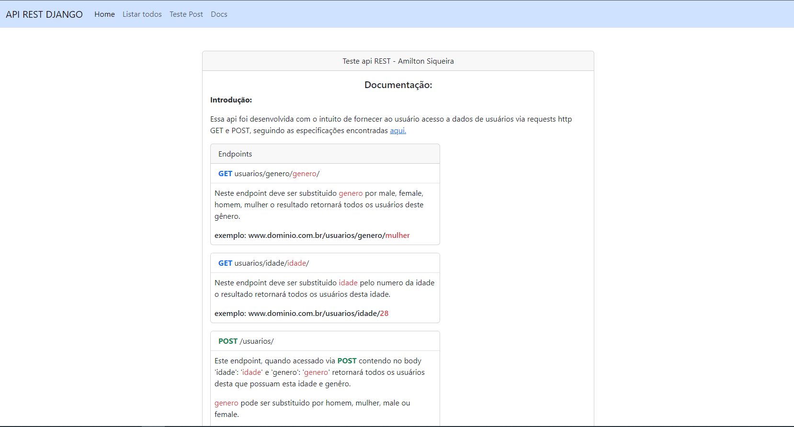  
    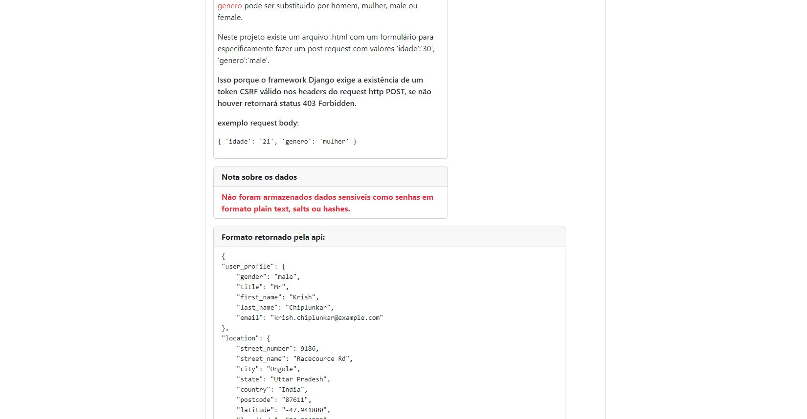  
    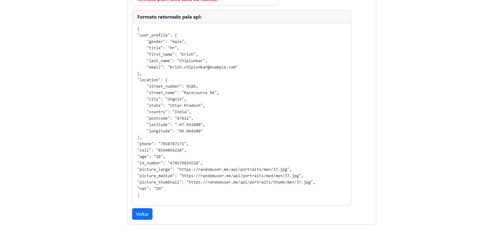  

### listar todos os objetos
    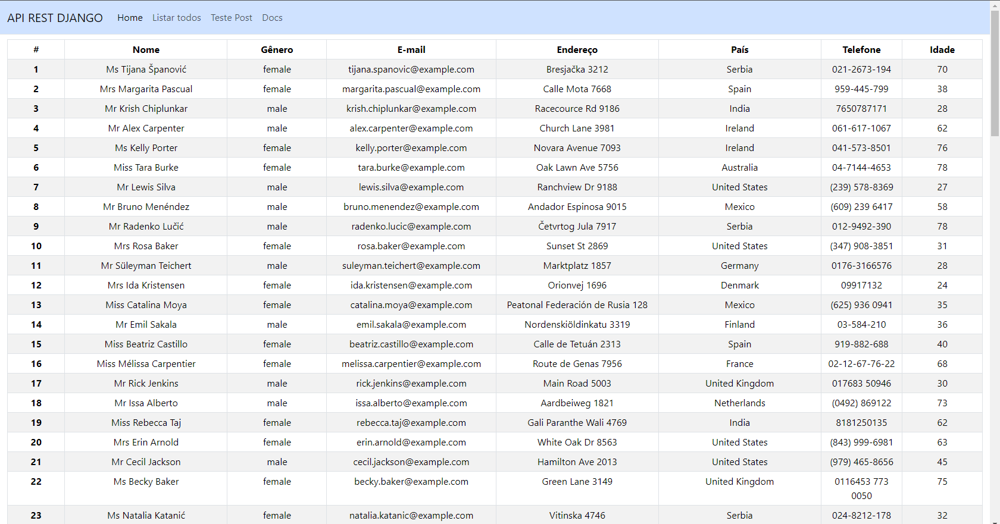  

### home
    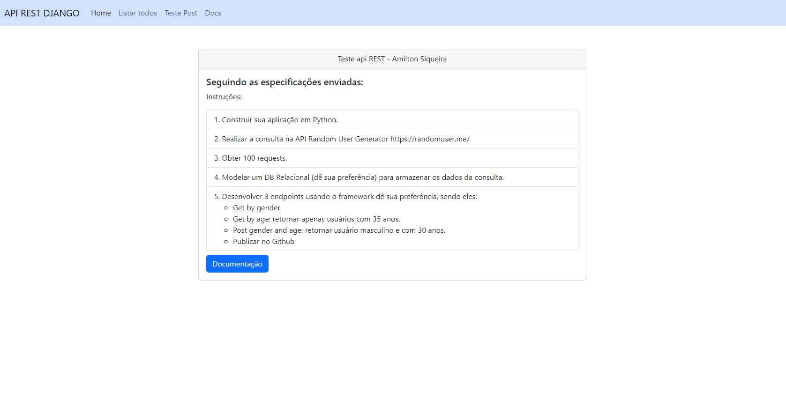

### teste POST REQUEST

    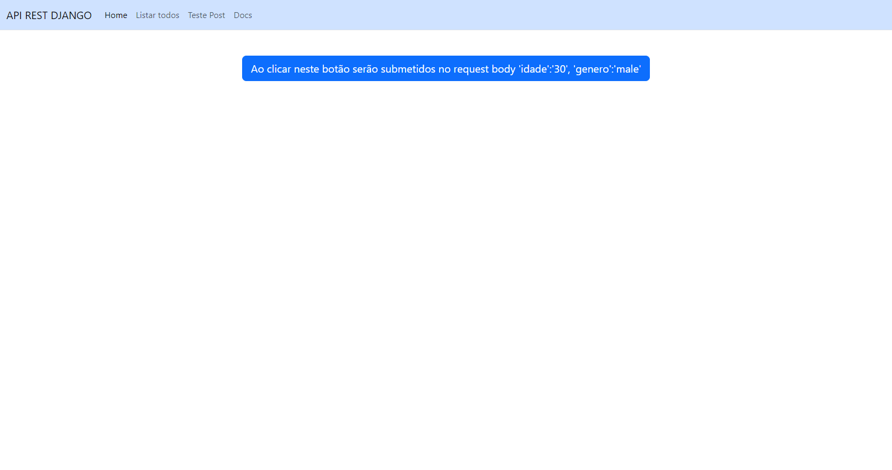  
    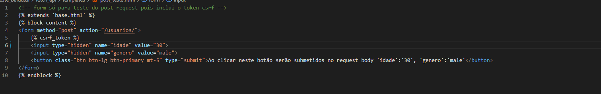  
    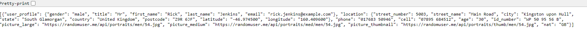

### erros ao acessar os endpoints

    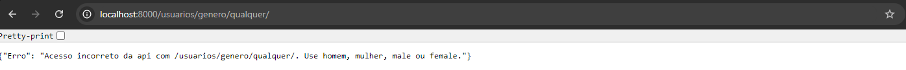
    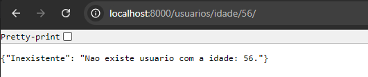
    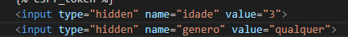
    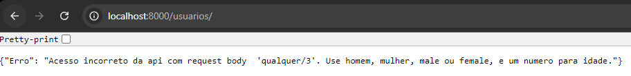